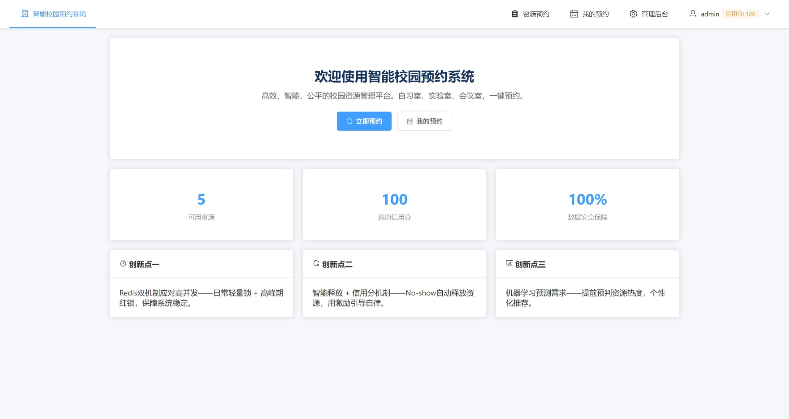
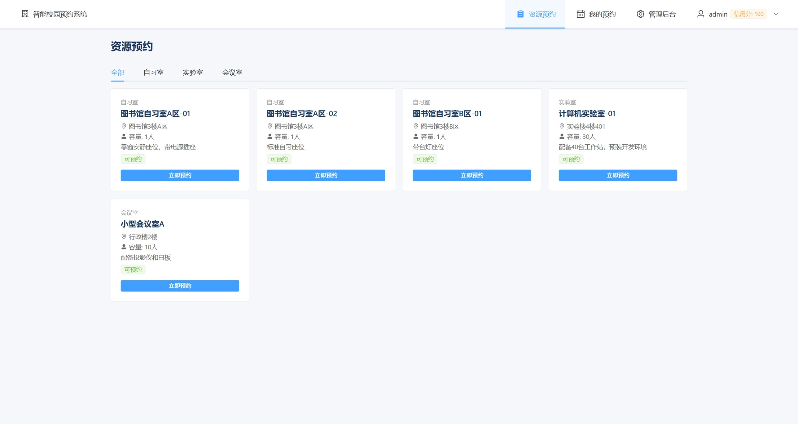
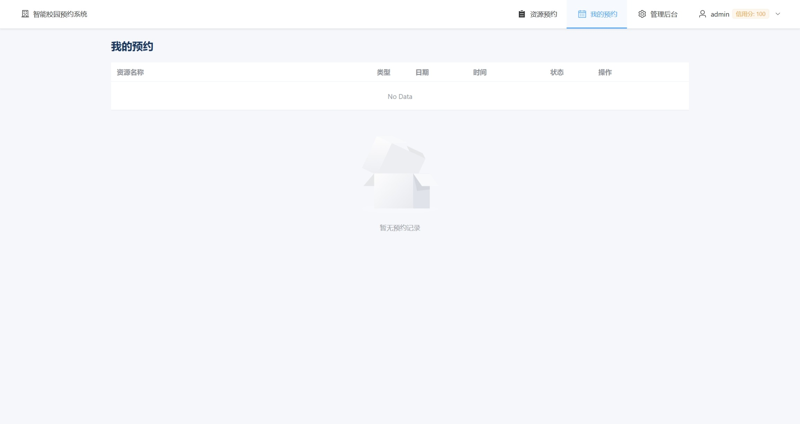
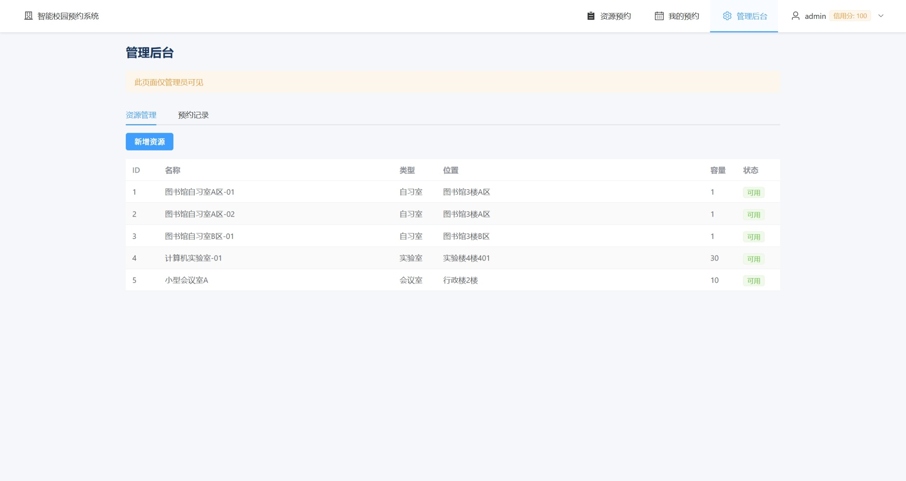
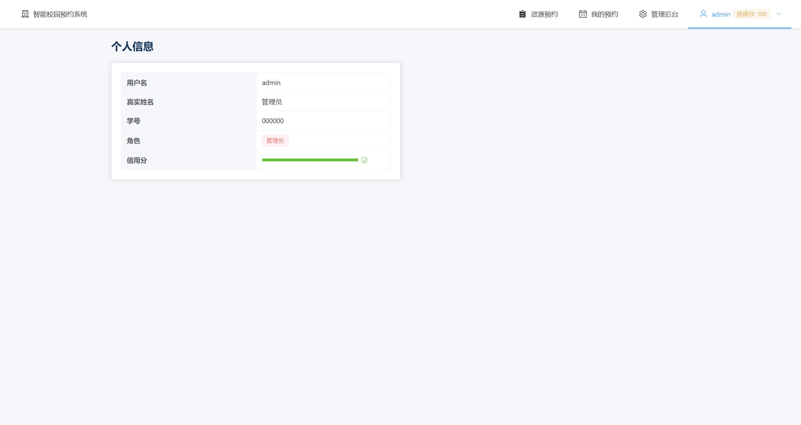

# 智能校园预约系统 🎓

<div align="center">

**从可复制的代码，到不可复制的系统**

[](https://spring.io/projects/spring-boot)
[](https://vuejs.org/)
[](https://www.mysql.com/)
[](https://redis.io/)
[](https://www.docker.com/)
[](LICENSE)

</div>

---

## 📋 目录

- [项目简介](#-项目简介)
- [系统架构](#-系统架构)
- [核心技术栈](#-核心技术栈)
- [三大创新点](#-三大创新点)
- [功能概览](#-功能概览)
- [快速启动](#-快速启动)
- [默认账号](#-默认账号)
- [API 概览](#-api-概览)
- [项目结构](#-项目结构)
- [演示截图](#-演示截图)
- [关于](#-关于)

---

## 🎯 项目简介

智能校园预约系统是一个面向高校的校园资源管理平台，专为解决三大痛点而设计：

| 痛点 | 问题描述 | 解决方案 |
|------|---------|---------|
| **预约难** | 自习室、实验室、会议室资源紧张，抢不到位置 | 在线预约 + 时间冲突检测 |
| **使用乱** | 预约后不签到、随意取消，资源浪费严重 | 信用分体系 + No-show 自动释放 |
| **管理黑** | 资源使用情况不透明，管理员无法掌握全局 | 管理后台 + 数据可视化 |

---

## 🏗️ 系统架构

```
┌──────────────────────────────────────────────────────┐
│                   表现层 (Presentation)                │
│         Vue 3 + Vite + Element Plus + Axios           │
│              Web / 小程序 / App                       │
├──────────────────────────────────────────────────────┤
│                   应用层 (Application)                 │
│           Spring Boot 3 + JPA + Spring Security       │
│    用户中心 · 资源管理 · 预约服务 · 信用体系 · 管理后台  │
├──────────────────────────────────────────────────────┤
│                   数据层 (Data)                        │
│        MySQL 8.0 (业务) + Redis 7 (缓存)              │
│                Docker 容器化一键部署                    │
└──────────────────────────────────────────────────────┘
```

---

## 🛠️ 核心技术栈

| 层级 | 技术 | 用途 |
|------|------|------|
| **前端** | Vue 3 + Vite + Element Plus + Axios | 用户界面交互 |
| **后端** | Spring Boot 3 + JPA + Spring Security | 业务逻辑与安全认证 |
| **数据库** | MySQL 8.0 | 持久化存储业务数据 |
| **缓存** | Redis 7 | 高性能缓存与分布式锁 |
| **认证** | JWT (JSON Web Token) | 无状态身份认证 |
| **部署** | Docker + docker-compose | 一键容器化部署 |

---

## 💡 三大创新点

### 1️⃣ Redis 双机制应对高并发

| 场景 | 机制 | 说明 |
|------|------|------|
| 日常低并发 | 轻量锁 | 基于 Redis 单键原子操作，低开销 |
| 高峰期抢座 | 分布式红锁 (Redlock) | 多节点互斥，防止超卖 |

### 2️⃣ 智能释放 + 信用分机制

- **No-show 自动释放**：预约后未签到的资源自动释放，供他人使用
- **信用激励**：初始 100 分，正常使用加分，违约扣分
- **用机制引导自律**：让有限的资源得到最大化的利用

### 3️⃣ 数据驱动决策（拓展方向）

- 基于历史数据预测资源使用热度
- 智能推荐空闲时段
- 个性化资源推送

---

## ✨ 功能概览

| 模块 | 功能 | 角色 |
|------|------|------|
| 👤 **用户系统** | 注册、登录、JWT 身份认证 | 所有用户 |
| 📋 **资源管理** | 自习室/实验室/会议室查看与检索 | 所有用户 |
| 📅 **预约服务** | 在线预约、时间冲突检测、签到/取消 | 普通用户 |
| ⭐ **信用体系** | 信用分初始 100，自动扣分/加分 | 普通用户 |
| 🔧 **管理后台** | 资源 CRUD、预约记录查询统计 | 管理员 |

---

## 🚀 快速启动

### 前置条件

- 安装 **Docker** 和 **Docker Compose**
- 确保 3000、8080、3306、6379 端口未被占用

### 方式一：Docker 一键启动（推荐）

```bash
# 1. 克隆项目
git clone https://github.com/Vae-Scrooge/smart-campus-reservation.git
cd smart-campus-reservation

# 2. 一键启动所有服务
docker compose up -d

# 3. 查看运行状态
docker compose ps

# 4. （可选）查看实时日志
docker compose logs -f
```

启动后访问：

| 服务 | 地址 |
|------|------|
| 🌐 **前端页面** | [http://localhost:3000](http://localhost:3000) |
| 🔗 **后端 API** | [http://localhost:8080](http://localhost:8080) |

### 方式二：本地开发

#### 后端

```bash
# 需要 JDK 17+ 和 Maven
cd backend
mvn spring-boot:run
```

#### 前端

```bash
# 需要 Node.js 18+
cd frontend
npm install
npm run dev
```

---

## 👤 默认账号

| 角色 | 用户名 | 密码 | 权限说明 |
|------|--------|------|---------|
| 🔧 **管理员** | `admin` | `123456` | 资源管理、预约记录查看、系统配置 |
| 🧑‍🎓 **普通用户** | `zhangsan` | `123456` | 资源浏览、在线预约、个人中心 |
| 🧑‍🎓 **普通用户** | `lisi` | `123456` | 资源浏览、在线预约、个人中心 |

---

## 📡 API 概览

| 方法 | 路径 | 说明 | 认证 |
|------|------|------|------|
| `POST` | `/api/auth/login` | 用户登录，返回 JWT | ❌ |
| `POST` | `/api/auth/register` | 用户注册 | ❌ |
| `GET` | `/api/resources` | 获取所有资源列表 | ✅ |
| `GET` | `/api/resources/{id}` | 获取单个资源详情 | ✅ |
| `GET` | `/api/resources/type/{type}` | 按类型筛选资源 | ✅ |
| `GET` | `/api/reservations/my` | 获取我的预约列表 | ✅ |
| `POST` | `/api/reservations` | 创建新预约 | ✅ |
| `PUT` | `/api/reservations/{id}/cancel` | 取消预约 | ✅ |
| `PUT` | `/api/reservations/{id}/checkin` | 签到 | ✅ |
| `GET` | `/api/user/profile` | 获取用户信息 | ✅ |

---

## 📁 项目结构

```
smart-campus-reservation/
│
├── backend/                        # Spring Boot 后端
│   ├── src/
│   │   ├── main/
│   │   │   ├── java/com/smartcampus/
│   │   │   │   ├── config/         # 安全、JWT、Redis 配置
│   │   │   │   ├── controller/     # REST API 控制器
│   │   │   │   ├── dto/            # 数据传输对象
│   │   │   │   ├── model/          # 实体类
│   │   │   │   ├── repository/     # 数据访问层
│   │   │   │   └── service/        # 业务逻辑层
│   │   │   └── resources/
│   │   │       ├── application.yml # 应用配置
│   │   │       └── init.sql        # 数据库初始化脚本
│   │   └── test/
│   └── pom.xml
│
├── frontend/                       # Vue 3 前端
│   ├── src/
│   │   ├── api/                    # API 接口封装
│   │   ├── assets/                 # 静态资源
│   │   ├── components/             # 公共组件
│   │   ├── router/                 # 路由配置
│   │   ├── store/                  # 状态管理 (Pinia)
│   │   └── views/                  # 页面组件
│   │       ├── Home.vue
│   │       ├── Login.vue
│   │       ├── Resources.vue
│   │       ├── Reservations.vue
│   │       ├── Admin.vue
│   │       └── Profile.vue
│   └── package.json
│
├── screenshots/                    # 演示截图
├── docker-compose.yml              # Docker 容器编排
└── README.md
```

---

## 📸 演示截图

| 页面 | 截图 |
|------|------|
| 🔑 **登录页** |  |
| 📋 **资源列表** |  |
| 📅 **预约管理** |  |
| 🔧 **管理后台** |  |
| 👤 **个人中心** |  |

---

## 📄 关于

**软件工程 4 班第 3 组 · 创新创业理论与实务课程项目**

如有问题或建议，欢迎提交 [Issue](https://github.com/Vae-Scrooge/smart-campus-reservation/issues) 或 Pull Request。
